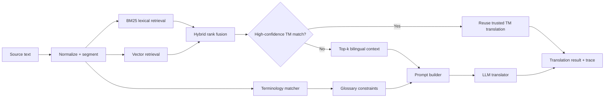

# Multilingual Clinical Translation RAG Demo

A portfolio-safe reconstruction of a multilingual translation workflow using **translation memory (TM)**, **hybrid retrieval**, **terminology constraints**, and **LLM generation**.

> **Portfolio note:** This repository is my independent reconstruction created for demonstration purposes. It contains **no employer source code, internal prompts, credentials, endpoints, datasets, study documents, or proprietary terminology assets**. All included data are small synthetic examples.

## Why this project

Clinical and technical translation is not only a text-generation problem. A useful system should also:

- reuse trusted historical translations when a very close match exists;
- retrieve similar bilingual examples when an exact match does not exist;
- enforce domain terminology consistently;
- preserve traceability by exposing which TM examples and terms were used;
- separate retrieval confidence from LLM generation.

## Architecture



## Key design ideas

1. **Hybrid retrieval** combines BM25 lexical matching with vector similarity.
2. **High-confidence routing** can reuse a trusted TM result instead of calling an LLM.
3. **Low-confidence routing** injects top-k bilingual examples as in-context evidence.
4. **Terminology constraints** identify source terms and pass approved translations to the generator.
5. **Traceable output** returns route, retrieval scores, matched TM examples, and matched glossary terms.
6. **Provider-neutral LLM client** uses environment variables; no credentials are stored in code.

## Repository structure

```text
medical-translation-rag-demo/
├── data/
│   ├── sample_glossary.csv
│   └── sample_translation_memory.csv
├── docs/
│   └── architecture.md
├── examples/
│   └── demo.py
├── scripts/
│   └── check_secrets.py
├── src/medtrans_rag/
│   ├── config.py
│   ├── elasticsearch_backend.py
│   ├── glossary.py
│   ├── llm.py
│   ├── metrics.py
│   ├── mlflow_model.py
│   ├── pipeline.py
│   ├── retrieval.py
│   └── schemas.py
├── tests/
├── .env.example
├── .gitignore
└── pyproject.toml
```

## Quick start

```bash
python -m venv .venv
source .venv/bin/activate  # Windows: .venv\\Scripts\\activate
pip install -e .
python examples/demo.py
```

The default demo runs in `dry_run=True`, so it does **not** call any external API. It shows the selected route, TM matches, glossary terms, and the prompt that would be sent to a translator model.

## Optional LLM generation

Copy `.env.example` to `.env` and set an OpenAI-compatible endpoint:

```bash
LLM_API_KEY=your_key_here
LLM_BASE_URL=https://your-provider.example/v1
LLM_MODEL=your-model-name
```

Then construct `HTTPChatTranslator` and run the pipeline with `dry_run=False`.

## Optional Elasticsearch backend

`medtrans_rag.elasticsearch_backend` demonstrates a portfolio-safe hybrid search backend using **Elasticsearch lexical matching + kNN vector search + reciprocal-rank fusion**. Credentials and index names come only from environment variables. The embedding vector is supplied by the caller so the retrieval layer stays provider-independent.

```bash
pip install -e '.[elasticsearch]'
```

## Optional MLflow wrapper

`medtrans_rag.mlflow_model` shows how the public pipeline can be packaged as an `mlflow.pyfunc.PythonModel` with the synthetic TM and glossary passed as model artifacts.

```bash
pip install -e '.[mlflow]'
python examples/log_mlflow_model.py
```

## Example routing behavior

For a sentence very close to a trusted translation-memory entry, the pipeline can choose:

```text
route = tm_reuse
```

For a novel sentence, it chooses:

```text
route = llm_with_context
```

and provides the model with retrieved bilingual examples and matched terminology.

## Evaluation

`medtrans_rag.metrics` includes lightweight portfolio metrics for:

- retrieval Hit@K;
- normalized edit similarity;
- terminology coverage.

For a real production evaluation, add task-specific human review and established translation-quality metrics appropriate to the domain.

## Disclaimer

This project is for my portfolio use. It is not a validated clinical translation system and should not be used for medical decision-making or regulated production workflows.
